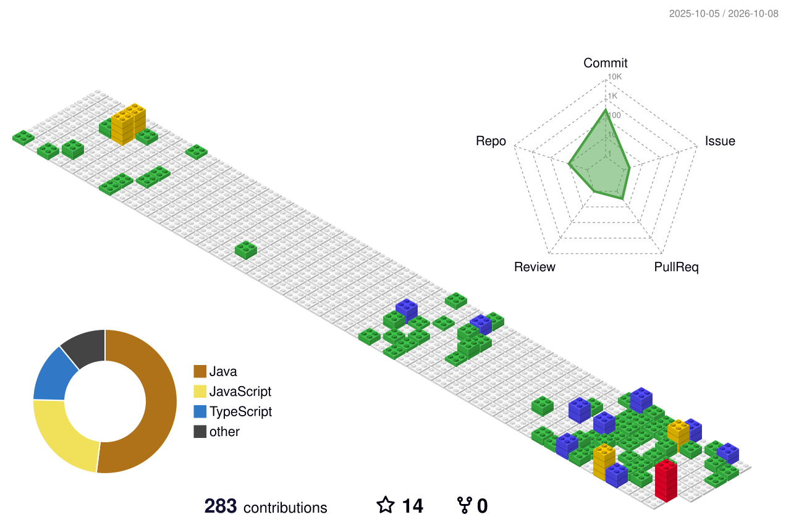

 

 

 

---

# 💫 About Me

I am a **Computer Science and Business Systems student at KIT's College of Engineering, Kolhapur** 🎓, focused on building practical solutions across **Data Analytics 📊, AI/ML 🤖, Software Engineering ⚙️**.

My work combines analytical thinking 🧠 with engineering fundamentals — from transforming raw datasets 🔄 and designing KPI-driven dashboards 📈 to building recommendation systems 🎯, REST APIs 🔌, database-backed applications 🗄️, and machine-learning workflows 🤖.

I enjoy working across the complete lifecycle of a product:

**📊 Data → ⚙️ Processing → 🧠 Intelligence → 🔌 API → 💻 Application → 💡 Insight**

My current technical focus includes **Python 🐍, SQL 🗃️, Pandas 🐼, NumPy 🔢, Power BI 📊, FastAPI ⚡, PostgreSQL 🐘, Scikit-learn 🤖, TensorFlow 🧠, Keras 🔥, PyTorch ⚡, Git 🌿, and GitHub 🐙**.

I approach projects with a **product-engineering mindset 🚀**: understand the problem 🔍, structure the data 🗂️, design the system 🏗️, validate the implementation ✅, and communicate the result clearly 📌.

### 🚀 Open To

- 📊 Entry-level **Data Analyst** opportunities
- 🤖 **AI/ML & Recommendation Systems** projects
- ⚙️ **Data Engineering** internships and learning opportunities
- 🌐 Collaborative analytics, ML, and open-source projects

---
## 🌐 Socials

  
  
  
  

---

## 💻 Tech Stack

<table>
<tr>
<td valign="top" width="50%">

### ⚡ Programming

### 🌐 Frontend

### ⚙️ Backend

### 🗄️ Databases

</td>

<td valign="top" width="50%">

### 📊 Data & Visualization

### 🤖 AI / ML

### ☁️ Cloud & DevOps

### 🛠️ Tools

</td>
</tr>
</table>

# 📊 GitHub Stats

  

  

🧊 3D contribution visualization&nbsp;&nbsp;•&nbsp;&nbsp;
📈 Activity timeline&nbsp;&nbsp;•&nbsp;&nbsp;
⚡ Powered by GitHub activity

